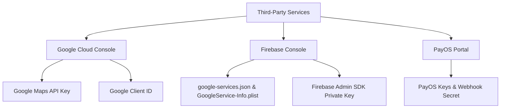

# Hướng Dẫn Vận Hành Môi Trường Phát Triển (Local Run Guide)

> **Dự án**: Football Booking System  
> **Phiên bản**: 1.0  
> **Tài liệu**: Hướng dẫn cấu hình chi tiết bên thứ ba và chạy local.

---

## 1. Các công cụ cần chuẩn bị (Prerequisites)
Trước khi bắt đầu, hãy đảm bảo máy tính của bạn đã cài đặt các công cụ sau:
*   **Java Development Kit (JDK)**: Phiên bản **17**.
*   **Maven**: Công cụ build backend.
*   **PostgreSQL**: Hệ quản trị cơ sở dữ liệu.
*   **Flutter SDK**: Phiên bản **3.x** mới nhất.
*   **IDE**: VS Code, Android Studio hoặc IntelliJ IDEA.
*   **Thiết bị chạy thử**: Máy ảo Android (Android Emulator), máy ảo iOS (iOS Simulator) hoặc điện thoại thật đã bật chế độ nhà phát triển (Developer Mode) và gỡ lỗi qua USB (USB Debugging).

---

## 2. Đăng ký và cấu hình các dịch vụ bên thứ ba (Third-Party Setup)

Dự án sử dụng các dịch vụ của Google (Map, Auth), Firebase (FCM), và PayOS (Thanh toán). Dưới đây là hướng dẫn chi tiết cách lấy key và file cấu hình.



---

### 2.1. Google Cloud Console (Google Maps & Đăng nhập Google)
Để tích hợp bản đồ vệ tinh và tính năng đăng nhập bằng Gmail:

1.  **Tạo dự án**:
    *   Truy cập [Google Cloud Console](https://console.cloud.google.com/).
    *   Đăng nhập bằng tài khoản Google của bạn, nhấn **New Project** và đặt tên dự án (ví dụ: `football-booking`).
2.  **Kích hoạt các API**:
    *   Vào menu **APIs & Services** > **Library**.
    *   Tìm kiếm và nhấn **Enable** các API sau:
        *   `Maps SDK for Android` (phục vụ bản đồ trên Android).
        *   `Maps SDK for iOS` (phục vụ bản đồ trên iOS).
3.  **Tạo Google Maps API Key**:
    *   Vào **APIs & Services** > **Credentials**.
    *   Nhấn **+ Create Credentials** > **API key**.
    *   Hệ thống sẽ tạo ra một chuỗi (ví dụ: `AIzaSyA1...`). Sao chép chuỗi này để cấu hình ở mục 3.
4.  **Cấu hình Màn hình đồng ý OAuth (OAuth Consent Screen)**:
    *   Vào **APIs & Services** > **OAuth consent screen**.
    *   Chọn loại **External**, nhấn **Create**.
    *   Điền các thông tin bắt buộc: App name, User support email, Developer contact information. Nhấn **Save and Continue** qua các bước tiếp theo đến khi hoàn thành.
5.  **Tạo Client ID phục vụ Đăng nhập Google**:
    *   Quay lại tab **Credentials**, nhấn **+ Create Credentials** > **OAuth client ID**.
    *   **Tạo Web Client ID (Dành cho Backend xác thực)**:
        *   Chọn Application type: **Web application**.
        *   Đặt tên: `Web Client Backend`.
        *   Nhấn **Create** và sao chép **Client ID** (chuỗi kết thúc bằng `.apps.googleusercontent.com`) và **Client Secret**.
    *   **Tạo Android Client ID (Dành cho App Android)**:
        *   Chọn Application type: **Android**.
        *   Điền Package name: `com.example.football_booking_flutter` (xem tại `android/app/build.gradle`).
        *   Lấy mã vân tay SHA-1 của máy tính phát triển (Xem cách lấy ở dưới) và điền vào ô tương ứng. Nhấn **Create**.
    *   **Tạo iOS Client ID (Dành cho App iOS)**:
        *   Chọn Application type: **iOS**.
        *   Điền Bundle ID: `com.example.footballBookingFlutter` (xem trong Xcode). Nhấn **Create**.

> [!TIP]
> **Cách lấy mã SHA-1 trên máy tính cá nhân**:
> *   **Windows**: Mở CMD và chạy:
>     `keytool -list -v -alias androiddebugkey -keystore %USERPROFILE%\.android\debug.keystore -storepass android`
> *   **macOS/Linux**: Mở Terminal và chạy:
>     `keytool -list -v -alias androiddebugkey -keystore ~/.android/debug.keystore -storepass android`
> *   Tìm dòng chữ `SHA1: XX:XX:XX...` và copy chuỗi đó.

---

### 2.2. Firebase Console (Gửi thông báo đẩy - FCM)
Để gửi thông báo đẩy từ Backend tới thiết bị di động khi có sự kiện đặt sân:

1.  **Tạo dự án Firebase**:
    *   Truy cập [Firebase Console](https://console.firebase.google.com/).
    *   Nhấn **Add project**, chọn dự án Google Cloud bạn vừa tạo ở trên (`football-booking`) để liên kết nhanh chóng.
2.  **Thêm ứng dụng di động vào Firebase**:
    *   **Thêm App Android**:
        *   Click biểu tượng **Android**. Điền Package name: `com.example.football_booking_flutter`.
        *   Nhấn **Register app**.
        *   Tải xuống tệp [google-services.json](file:///c:/Users/Admin/IdeaProjects/football_booking/frontend/android/app/google-services.json) và đặt vào thư mục `frontend/android/app/`.
    *   **Thêm App iOS**:
        *   Click biểu tượng **iOS**. Điền Bundle ID: `com.example.footballBookingFlutter`.
        *   Nhấn **Register app**.
        *   Tải xuống tệp [GoogleService-Info.plist](file:///c:/Users/Admin/IdeaProjects/football_booking/frontend/ios/Runner/GoogleService-Info.plist) và đặt vào thư mục `frontend/ios/Runner/`.
3.  **Tải khóa riêng tư Admin (Dành cho Spring Boot Backend)**:
    *   Tại Firebase Console, nhấn vào biểu tượng **Bánh răng cài đặt (Project settings)** > **Service accounts**.
    *   Nhấn chọn **Java**, sau đó click **Generate new private key**.
    *   Một file đuôi `.json` chứa khóa riêng tư sẽ được tải về máy tính của bạn (ví dụ: `football-booking-firebase-adminsdk-xxxx.json`).
    *   **Đổi tên file** này thành `firebase-service-account.json` và di chuyển nó vào thư mục tài nguyên của Backend tại [backend/src/main/resources/firebase-service-account.json](file:///c:/Users/Admin/IdeaProjects/football_booking/backend/src/main/resources/firebase-service-account.json).

---

### 2.3. Cổng thanh toán PayOS (VietQR)
Để chạy thử tính năng thanh toán tiền cọc qua mã ngân hàng QR:

1.  **Đăng ký tài khoản**:
    *   Truy cập trang chủ [PayOS](https://payos.vn/) và đăng ký tài khoản doanh nghiệp hoặc cá nhân dùng thử.
2.  **Tạo kênh thanh toán thử nghiệm**:
    *   Đăng nhập vào **PayOS Dashboard**.
    *   Vào mục **Cài đặt** > **Khóa API** (API Keys).
    *   Bạn sẽ nhìn thấy 3 mã khóa quan trọng ở chế độ **Test (Thử nghiệm)**:
        *   `Client ID`
        *   `API Key`
        *   `Checksum Key`
    *   Hãy lưu lại 3 mã này để điền vào cấu hình Backend.

---

## 3. Cấu hình và khởi chạy Backend (Spring Boot)

1.  **Cấu hình tệp thuộc tính**:
    *   Sao chép tệp mẫu `application-example.properties` thành tệp thực tế `application.properties` tại thư mục [backend/src/main/resources](file:///c:/Users/Admin/IdeaProjects/football_booking/backend/src/main/resources).
    *   Cập nhật các giá trị của bạn:
        ```properties
        # Kết nối PostgreSQL
        spring.datasource.url=jdbc:postgresql://localhost:5740/FootballField
        spring.datasource.username=postgres
        spring.datasource.password=123456

        # Cấu hình JWT
        jwt.secret=ChuoiBiMatTuDatCucKyDaiDeDamBaoAnToanNghiemNgatCuaBan123456

        # Cấu hình Google Web Client ID
        google.client-id=xxxxxx.apps.googleusercontent.com

        # Cấu hình PayOS
        payos.client-id=ma_client_id_payos
        payos.api-key=ma_api_key_payos
        payos.checksum-key=ma_checksum_key_payos

        # Cấu hình đường dẫn tệp Firebase Admin SDK
        app.firebase-config-path=classpath:firebase-service-account.json
        ```
2.  **Khởi động Database**:
    *   Đảm bảo PostgreSQL đang chạy trên cổng cấu hình (mặc định là `5432` hoặc `5740` tùy máy của bạn).
    *   Tạo một cơ sở dữ liệu trống tên là `FootballField`.
3.  **Chạy Backend**:
    Mở terminal tại thư mục `backend` và thực hiện lệnh:
    ```bash
    mvn spring-boot:run
    ```
    Hệ thống sẽ tự tạo các bảng dữ liệu trong database và chạy trên cổng `8080`.

---

## 4. Cấu hình và khởi chạy Frontend (Flutter)

### 4.1. Nhúng Google Maps API Key vào Mã nguồn di động
*   **Cấu hình trên Android**:
    Mở tệp [AndroidManifest.xml](file:///c:/Users/Admin/IdeaProjects/football_booking/frontend/android/app/src/main/AndroidManifest.xml), tìm đến thẻ `<meta-data>` và thay thế giá trị API Key của bạn:
    ```xml
    <meta-data 
        android:name="com.google.android.geo.API_KEY"
        android:value="API_KEY_GOOGLE_MAPS_CUA_BAN"/>
    ```
*   **Cấu hình trên iOS**:
    Mở tệp [AppDelegate.swift](file:///c:/Users/Admin/IdeaProjects/football_booking/frontend/ios/Runner/AppDelegate.swift) và thay thế API Key:
    ```swift
    GMSServices.provideAPIKey("API_KEY_GOOGLE_MAPS_CUA_BAN")
    ```

### 4.2. Cấu hình địa chỉ IP máy chủ Backend
Mở tệp [app_constants.dart](file:///c:/Users/Admin/IdeaProjects/football_booking/frontend/lib/core/constants/app_constants.dart) và cập nhật địa chỉ IP:
*   Nếu chạy máy ảo Android: Giữ nguyên `http://10.0.2.2:8080`.
*   Nếu chạy máy ảo iOS hoặc Thiết bị thật: Tìm địa chỉ IP mạng nội bộ (Wi-Fi) của máy tính bạn (ví dụ: `192.168.1.15`) và đổi URL thành `http://192.168.1.15:8080`.

### 4.3. Chạy ứng dụng
Mở terminal tại thư mục `frontend` và thực hiện:
```bash
flutter pub get
flutter run
```
Chọn thiết bị ảo hoặc thiết bị thật kết nối để trải nghiệm ứng dụng đặt sân.
