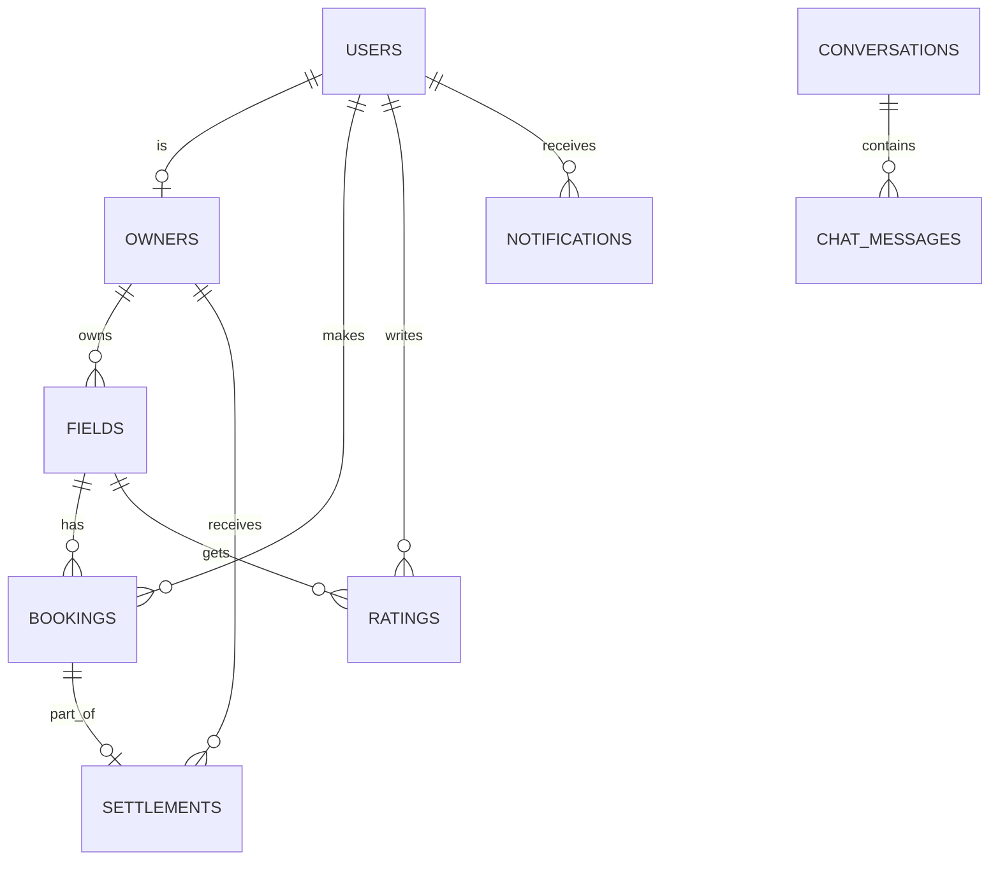
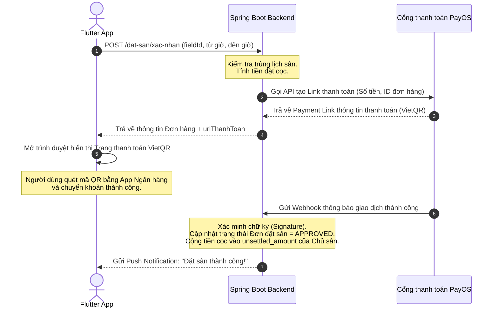
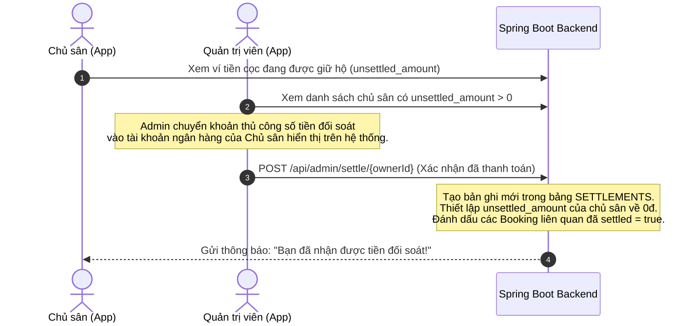

# Tài Liệu Thiết Kế Hệ Thống (System Design) – Football Booking System

## 1. Kiến trúc tổng thể (Architecture Design)

Hệ thống được thiết kế theo mô hình **Client-Server** truyền thống, giao tiếp bất đồng bộ qua giao thức **HTTP/JSON RESTful API**.

### 1.1. Kiến trúc Backend (Spring Boot)
Mã nguồn Backend áp dụng mô hình phân lớp chuẩn (Layered Architecture):

```text
[Client (Flutter App)]
       │ (REST API over HTTP)
       ▼
┌─────────────────────────────────────────────────────────┐
│                    BACKEND SYSTEM                       │
│                                                         │
│  ┌───────────────────────────────────────────────────┐  │
│  │                 Controller Layer                  │  │
│  │  - Tiếp nhận HTTP Request, xử lý định tuyến       │  │
│  │  - Xác thực quyền hạn, kiểm tra dữ liệu đầu vào   │  │
│  └───────────────────────┬───────────────────────────┘  │
│                          ▼                              │
│  ┌───────────────────────────────────────────────────┐  │
│  │                   Service Layer                   │  │
│  │  - Xử lý logic nghiệp vụ hệ thống (Business)     │  │
│  │  - Điều phối các tác vụ giao dịch (Transactions)  │  │
│  └───────────────────────┬───────────────────────────┘  │
│                          ▼                              │
│  ┌───────────────────────────────────────────────────┐  │
│  │                 Repository Layer                  │  │
│  │  - Giao tiếp Database qua Spring Data JPA         │  │
│  │  - Thực thi các câu lệnh SQL / HQL                 │  │
│  └───────────────────────┬───────────────────────────┘  │
└──────────────────────────┼──────────────────────────────┘
                           ▼
                 ┌───────────────────┐
                 │    PostgreSQL     │
                 │   (Database)      │
                 └───────────────────┘
```

*   **Controller Layer**: Định nghĩa các Endpoint REST API. Nhận DTO từ client, gọi các Service tương ứng và trả về ResponseEntity chứa dữ liệu hoặc thông báo lỗi.
*   **Service Layer**: Nơi tập trung toàn bộ logic nghiệp vụ (ví dụ: kiểm tra trùng lịch sân, tính toán số tiền cọc, tạo link thanh toán qua PayOS).
*   **Repository Layer**: Kế thừa `JpaRepository` để thực hiện các câu lệnh truy vấn dữ liệu từ PostgreSQL mà không cần viết SQL thuần.

---

### 1.2. Kiến trúc Frontend (Flutter)
Ứng dụng di động áp dụng mô hình **MVVM** kết hợp với **Provider Pattern**:

```text
┌─────────────────────────────────────────────────────────────────┐
│                        FLUTTER CLIENT                           │
│                                                                 │
│  ┌───────────────────────────────────────────────────────────┐  │
│  │                        Giao diện (UI)                     │  │
│  │  - Các Screens/Widgets (Stateful/Stateless Widget)         │  │
│  │  - Đăng ký lắng nghe trạng thái từ Provider               │  │
│  └─────────────────────────────┬─────────────────────────────┘  │
│                                │       │
│                                ▼                                │
│  ┌───────────────────────────────────────────────────────────┐  │
│  │                       Provider Layer                      │  │
│  │  - Lớp ChangeNotifier quản lý trạng thái hiển thị        │  │
│  │  - Gọi các phương thức nghiệp vụ từ Repository           │  │
│  │  - Phát thông báo `notifyListeners()` để cập nhật UI     │  │
│  └─────────────────────────────┬─────────────────────────────┘  │
│                                │                                │
│                                ▼                                │
│  ┌───────────────────────────────────────────────────────────┐  │
│  │                      Repository Layer                     │  │
│  │  - Các lớp truy xuất dữ liệu thuần (Pure Dart Class)     │  │
│  │  - Gọi API qua ApiClient, phân tích JSON thành Model     │  │
│  └─────────────────────────────┬─────────────────────────────┘  │
│                                │                                │
│                                ▼                                │
│  ┌───────────────────────────────────────────────────────────┐  │
│  │                Mạng tập trung (ApiClient)                 │  │
│  │  - Xử lý gắn Token JWT tự động, xử lý mã lỗi HTTP         │  │
│  └───────────────────────────────────────────────────────────┘  │
└─────────────────────────────────────────────────────────────────┘
```

---

## 2. Thiết kế cơ sở dữ liệu (Database Schema)

Cơ sở dữ liệu PostgreSQL bao gồm các bảng chính để lưu giữ thông tin của hệ thống:



### 2.1. Bảng `users` (Thông tin tài khoản chung)
Lưu trữ thông tin đăng nhập và hồ sơ cá nhân của tất cả người dùng (Khách, Chủ sân, Admin).
*   `id` (SERIAL, Primary Key)
*   `name` (VARCHAR, Not Null): Tên hiển thị.
*   `email` (VARCHAR, Unique, Not Null): Email dùng để đăng nhập.
*   `password` (VARCHAR, Not Null): Mật khẩu đã được mã hóa bằng BCrypt.
*   `phone` (VARCHAR, Null): Số điện thoại liên lạc.
*   `role` (VARCHAR, Not Null): Quyền hạn (`CUSTOMER`, `OWNER`, `ADMIN`).
*   `is_active` (BOOLEAN, Default True): Trạng thái hoạt động của tài khoản.
*   `created_at` (TIMESTAMP): Thời gian tạo tài khoản.

### 2.2. Bảng `owners` (Thông tin cấu hình tài khoản chủ sân)
Liên kết 1-1 với bảng `users` dành cho tài khoản có quyền `OWNER` để cấu hình ngân hàng.
*   `id` (SERIAL, Primary Key)
*   `user_id` (INT, Foreign Key -> `users.id`, Unique)
*   `bank_name` (VARCHAR): Tên ngân hàng nhận tiền cọc đối soát.
*   `bank_account_no` (VARCHAR): Số tài khoản ngân hàng.
*   `bank_account_name` (VARCHAR): Tên chủ tài khoản ngân hàng.
*   `unsettled_amount` (DECIMAL, Default 0.0): Số tiền cọc hệ thống đang giữ hộ chưa thanh toán cho chủ sân này.

### 2.3. Bảng `fields` (Thông tin sân bóng)
Lưu trữ thông tin các tổ hợp sân bóng do chủ sân đăng tải.
*   `id` (SERIAL, Primary Key)
*   `owner_id` (INT, Foreign Key -> `owners.id`): Chủ sở hữu sân.
*   `name` (VARCHAR, Not Null): Tên sân bóng.
*   `address` (VARCHAR, Not Null): Địa chỉ chi tiết.
*   `latitude` (DOUBLE): Vĩ độ phục vụ định vị bản đồ.
*   `longitude` (DOUBLE): Kinh độ phục vụ định vị bản đồ.
*   `price_per_hour` (DECIMAL, Not Null): Giá thuê cơ bản mỗi giờ.
*   `description` (TEXT): Giới thiệu chi tiết sân.
*   `image_url` (VARCHAR): Đường dẫn ảnh đại diện sân.
*   `is_active` (BOOLEAN, Default True): Sân có đang hoạt động hay không.

### 2.4. Bảng `bookings` (Thông tin đơn đặt sân)
Lưu trữ lịch sử đặt sân của khách hàng.
*   `id` (SERIAL, Primary Key)
*   `customer_id` (INT, Foreign Key -> `users.id`): Người đặt sân.
*   `field_id` (INT, Foreign Key -> `fields.id`): Sân bóng được đặt.
*   `from_time` (TIMESTAMP, Not Null): Thời gian bắt đầu trận đấu.
*   `to_time` (TIMESTAMP, Not Null): Thời gian kết thúc trận đấu.
*   `total_price` (DECIMAL, Not Null): Số tiền cọc cần đóng (thường bằng 100% hoặc 50% tiền sân).
*   `status` (VARCHAR, Default 'PENDING'): Trạng thái đơn đặt sân (`PENDING`, `APPROVED`, `CANCELLED`).
*   `payment_id` (VARCHAR): Mã giao dịch của cổng thanh toán PayOS.
*   `settled` (BOOLEAN, Default False): Đơn đặt sân đã được đối soát & chuyển tiền cho chủ sân chưa.
*   `created_at` (TIMESTAMP)

### 2.5. Bảng `settlements` (Lịch sử đối soát thanh toán)
Lưu trữ lịch sử chuyển tiền từ hệ thống Admin sang cho Chủ sân sau khi trận đấu kết thúc thành công.
*   `id` (SERIAL, Primary Key)
*   `owner_id` (INT, Foreign Key -> `owners.id`): Chủ sân nhận tiền.
*   `amount` (DECIMAL, Not Null): Số tiền đã thanh toán đối soát.
*   `settled_at` (TIMESTAMP): Thời điểm thực hiện thanh toán đối soát.
*   `admin_id` (INT, Foreign Key -> `users.id`): Admin thực hiện phê duyệt giao dịch.

### 2.6. Bảng `chat_messages` & `conversations` (Tính năng trò chuyện)
*   Bảng `conversations`: Lưu trữ thông tin cuộc hội thoại giữa Khách hàng và Chủ sân.
    *   `id` (SERIAL, Primary Key)
    *   `customer_id` (INT, Foreign Key -> `users.id`)
    *   `owner_id` (INT, Foreign Key -> `users.id`)
    *   `field_id` (INT, Foreign Key -> `fields.id`, Null)
*   Bảng `chat_messages`: Chi tiết tin nhắn trong cuộc hội thoại.
    *   `id` (SERIAL, Primary Key)
    *   `conversation_id` (INT, Foreign Key -> `conversations.id`)
    *   `sender_type` (VARCHAR): Người gửi là `USER` hay `OWNER`.
    *   `sender_id` (INT): ID của người gửi.
    *   `content` (TEXT, Not Null): Nội dung tin nhắn.
    *   `is_read` (BOOLEAN, Default False)
    *   `created_at` (TIMESTAMP)

---

## 3. Các luồng xử lý chính (System Workflows)

### 3.1. Luồng Đăng ký & Đặt cọc thanh toán sân bóng
Luồng xử lý khi người dùng chọn sân, đặt lịch và thanh toán tiền cọc qua cổng PayOS:



---

### 3.2. Luồng Đối soát tài chính cho Chủ sân (Settlement Workflow)
Quy trình thanh toán tiền cọc giữ hộ từ hệ thống về tài khoản ngân hàng của Chủ sân:



---

## 4. Bảo mật & Xác thực (Security & Authentication)

Hệ thống bảo mật sử dụng cơ chế **Stateless Authentication** dựa trên **JSON Web Token (JWT)** và **Spring Security**.

### 4.1. Quy trình xác thực JWT
1.  **Đăng nhập**: Client gửi email/mật khẩu tới `POST /api/users/login`.
2.  **Tạo Token**: Backend kiểm tra thông tin đăng nhập, nếu chính xác sẽ tạo một chuỗi JWT mã hóa thông tin người dùng (`id`, `email`, `role`) ký bằng thuật toán bảo mật HMAC256 với mã khóa bí mật (`jwt.secret`).
3.  **Lưu trữ**: Client nhận Token từ phản hồi API, lưu vào bộ nhớ thiết bị (`SharedPreferences`) thông qua lớp `ApiClient`.
4.  **Yêu cầu API**: Với tất cả các yêu cầu tiếp theo, `ApiClient` tự động đính kèm Token vào Header: `Authorization: Bearer <token>`.
5.  **Xác minh**: Lớp lọc `JwtAuthenticationFilter` trong Spring Boot chặn mọi yêu cầu, trích xuất Token, giải mã và nạp thông tin người dùng vào ngữ cảnh bảo mật (`SecurityContextHolder`) để phân quyền truy cập.

### 4.2. Đăng nhập qua bên thứ ba (Google OAuth2)
Ứng dụng hỗ trợ đăng nhập nhanh bằng tài khoản Google dành cho khách hàng:
1.  Client sử dụng SDK `google_sign_in` trên di động để yêu cầu người dùng đăng nhập và lấy chuỗi `idToken` từ Google.
2.  Client gửi `idToken` lên Backend thông qua endpoint `POST /api/oauth/google`.
3.  Backend sử dụng thư viện `GoogleIdTokenVerifier` để kiểm tra tính hợp lệ của Token trực tiếp với máy chủ Google.
4.  Nếu Token hợp lệ, Backend tìm kiếm tài khoản theo Email Google. Nếu chưa tồn tại, hệ thống tự động tạo tài khoản mới với quyền `CUSTOMER`.
5.  Backend trả về mã Token JWT của hệ thống cho Client để tiếp tục truy cập các API khác.

---

## 5. Tích hợp thanh toán PayOS (VietQR)

Hệ thống tích hợp cổng thanh toán **PayOS** của Casso để tạo mã VietQR chuyển khoản nhanh 24/7.

### 5.1. Tạo link thanh toán
Khi khách hàng nhấn đặt sân, Backend tạo đối tượng thanh toán gửi tới PayOS với các thông tin:
*   `orderCode`: Mã số ngẫu nhiên duy nhất (ánh xạ với ID của đơn đặt sân).
*   `amount`: Số tiền cọc cần đóng.
*   `description`: Nội dung chuyển khoản viết liền không dấu.
*   `cancelUrl` & `returnUrl`: URL điều hướng khách hàng khi hủy hoặc thanh toán xong trên nền tảng Web.

### 5.2. Xác thực Webhook an toàn
Để tránh việc giả mạo kết quả thanh toán, hệ thống triển khai cơ chế xác minh chữ ký:
1.  PayOS gửi dữ liệu Webhook kèm theo một chữ ký mã hóa SHA256 (`signature`) được tạo từ dữ liệu giao dịch và `checksum-key` của bạn.
2.  Backend tiếp nhận dữ liệu Webhook, sắp xếp các trường dữ liệu theo thứ tự bảng chữ cái và tự tạo lại mã hash SHA256 cục bộ bằng `checksum-key`.
3.  Nếu mã hash tự tạo trùng khớp với `signature` nhận được từ PayOS, dữ liệu giao dịch được xác thực là tin cậy và hệ thống mới tiến hành cập nhật trạng thái đơn đặt sân.
