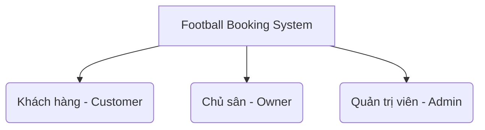

# Tài Liệu Tổng Quan Hệ Thống (System Overview) – Football Booking System

> **Phiên bản**: 1.0 | **Ngày cập nhật**: 30/06/2026  
> **Dự án**: Football Booking System (Hệ thống quản lý và đặt sân bóng đá)  
> **Cấu trúc**: Monorepo (Spring Boot Backend & Flutter Frontend)

---

## 1. Giới thiệu dự án

**Football Booking System** là giải pháp công nghệ toàn diện hỗ trợ kết nối giữa **Người chơi bóng đá (Khách hàng)** và **Chủ sân bóng (Đối tác kinh doanh)**. Hệ thống giải quyết các vấn đề khó khăn truyền thống trong việc tìm kiếm sân trống, quản lý giờ đặt trùng lặp, thanh toán tiền cọc giữ sân, đối soát doanh thu và liên lạc giữa hai bên.

Dự án được xây dựng dưới dạng **Monorepo** với hai thành phần chính:
*   **Backend**: Sử dụng Spring Boot (Java) cung cấp hệ thống API RESTful bảo mật, quản lý cơ sở dữ liệu PostgreSQL, tích hợp cổng thanh toán trực tuyến và xử lý logic nghiệp vụ.
*   **Frontend**: Sử dụng Flutter (Dart) phát triển ứng dụng di động đa nền tảng (Android & iOS) với giao diện người dùng hiện đại, hỗ trợ định vị trực quan và trải nghiệm mượt mà.

---

## 2. Các đối tượng người dùng (Target Users)

Hệ thống được thiết kế tối ưu hóa riêng biệt cho 3 nhóm đối tượng chính:



### 2.1. Khách hàng (Customer / Booker)
Là những người chơi bóng đá có nhu cầu tìm kiếm và đặt sân.
*   Tìm kiếm sân bóng xung quanh vị trí hiện tại dựa trên bản đồ vệ tinh (Google Maps).
*   Xem trạng thái sân trống theo thời gian thực (Real-time).
*   Đặt sân trực tuyến, đặt cọc giữ chỗ qua cổng thanh toán PayOS.
*   Nhận thông báo nhắc lịch đá sân, kết quả duyệt đơn hoặc thông báo hủy sân.
*   Nhắn tin trao đổi trực tiếp với chủ sân.
*   Đánh giá chất lượng sân bóng sau khi trải nghiệm.

### 2.2. Chủ sân (Field Owner)
Là các cá nhân hoặc tổ chức sở hữu, vận hành các tổ hợp sân bóng đá.
*   Đăng tải và quản lý thông tin sân bóng (tên sân, địa chỉ, hình ảnh, tiện ích).
*   Cấu hình linh hoạt bảng giá theo các khung giờ (giờ vàng, giờ thường) và ngày trong tuần.
*   Quản lý danh sách đơn đặt sân (Phê duyệt đơn, hủy đơn, theo dõi trạng thái cọc).
*   Quản lý doanh thu, ví tiền cọc giữ hộ và yêu cầu đối soát định kỳ với hệ thống.
*   Trò chuyện, hỗ trợ khách hàng đặt sân.

### 2.3. Quản trị viên (System Administrator)
Là ban quản trị vận hành toàn bộ hệ thống ứng dụng.
*   Giám sát tổng quan hệ thống (tổng số lượng sân hoạt động, số người dùng mới, số đơn đặt sân trong ngày).
*   Kiểm duyệt và quản lý thông tin tài khoản (khóa/mở khóa tài khoản khách hàng và chủ sân).
*   Quản lý danh sách sân bóng trên toàn quốc.
*   Thực hiện đối soát tài chính thủ công hoặc phê duyệt thanh toán cho các chủ sân.
*   Quản lý trạng thái hệ thống (bật/tắt chế độ bảo trì hệ thống).

---

## 3. Bản đồ tính năng (Feature Map)

| Phân hệ | Khách hàng (Customer) | Chủ sân (Owner) | Quản trị viên (Admin) |
| :--- | :--- | :--- | :--- |
| **Xác thực & Tài khoản** | - Đăng ký / Đăng nhập thường<br>- Đăng nhập Google OAuth2<br>- Quản lý hồ sơ cá nhân<br>- Cấu hình chế độ sáng/tối (Dark Mode) | - Đăng ký / Đăng nhập<br>- Quản lý hồ sơ doanh nghiệp<br>- Cấu hình tài khoản ngân hàng nhận tiền | - Đăng nhập tài khoản quản trị hệ thống<br>- Quản lý danh sách tài khoản người dùng |
| **Quản lý Sân bóng** | - Xem danh sách sân công cộng<br>- Tìm kiếm, lọc sân nâng cao<br>- Tìm sân qua Bản đồ vệ tinh<br>- Lưu sân yêu thích | - Thêm mới/Sửa/Xóa sân bóng<br>- Upload nhiều hình ảnh sân<br>- Cấu hình bảng giá khung giờ | - Kiểm duyệt sân bóng đăng tải<br>- Khóa/Mở khóa hoạt động của sân |
| **Đặt sân & Thanh toán** | - Chọn ngày, giờ và sân trống<br>- Đặt cọc trực tuyến qua cổng PayOS | - Theo dõi danh sách đơn đặt sân<br>- Cập nhật trạng thái sân trống | - Xem toàn bộ lịch sử giao dịch cọc<br>- Thống kê đơn đặt sân toàn hệ thống |
| **Tương tác & Đánh giá** | - Nhắn tin với chủ sân<br>- Đánh giá sân (Điểm số & Bình luận) | - Trò chuyện với khách hàng<br>- Phản hồi đánh giá của khách | - Giám sát lịch sử chat hệ thống |
| **Tài chính & Đối soát** | - Xem lịch sử đặt và số tiền đã chi | - Xem ví tiền cọc đang được giữ hộ<br>- Xem lịch sử đối soát và nhận tiền | - Nắm giữ tổng tiền cọc toàn hệ thống<br>- Thực hiện đối soát & thanh toán cho chủ sân |
| **Thông báo (Push Noti)** | - Nhận thông báo duyệt/hủy sân<br>- Nhắc lịch đá trước 1 tiếng | - Nhận thông báo khi có đơn đặt sân mới | - Gửi thông báo hệ thống bảo trì |

---

## 4. Công nghệ sử dụng (Technology Stack)

### 4.1. Hệ thống Backend (Spring Boot)
*   **Ngôn ngữ**: Java 17.
*   **Framework chính**: Spring Boot 3.x.
*   **Bảo mật & Xác thực**: Spring Security, JWT (JSON Web Token), Google API Client (OAuth2).
*   **Cơ sở dữ liệu**: PostgreSQL.
*   **Truy cập dữ liệu**: Spring Data JPA, Hibernate.
*   **Tài liệu hóa API**: Springdoc OpenAPI (Swagger UI).
*   **Tích hợp thanh toán**: PayOS SDK (VietQR).
*   **Thông báo**: Firebase Admin SDK (FCM).

### 4.2. Ứng dụng di động Frontend (Flutter)
*   **Ngôn ngữ**: Dart.
*   **Framework**: Flutter SDK 3.x.
*   **Quản lý trạng thái (State Management)**: `provider` package (ChangeNotifier Pattern).
*   **Kết nối mạng (HTTP Client)**: Lớp wrapper tập trung `ApiClient` tự phát triển dựa trên gói `http`.
*   **Bản đồ & Định vị**: `google_maps_flutter`, `geolocator`.
*   **Lưu trữ cục bộ**: `shared_preferences`.
*   **Thông báo đẩy**: `firebase_messaging`, `flutter_local_notifications`.
*   **Định dạng tiền tệ & ngày tháng**: `intl`.

---

## 5. Hướng dẫn cài đặt và chạy thử nhanh (Quick Start)

### 5.1. Khởi chạy Backend
1.  **Cài đặt môi trường**: Yêu cầu cài đặt sẵn **JDK 17** và **PostgreSQL**.
2.  **Tạo cơ sở dữ liệu**: Tạo một database trống trong PostgreSQL tên là `FootballField`.
3.  **Cấu hình**:
    *   Truy cập thư mục [backend/src/main/resources](file:///c:/Users/Admin/IdeaProjects/football_booking/backend/src/main/resources).
    *   Tạo file `application.properties` dựa trên nội dung file mẫu [application-example.properties](file:///c:/Users/Admin/IdeaProjects/football_booking/backend/src/main/resources/application-example.properties).
    *   Cập nhật thông tin kết nối Database (`username`, `password`), JWT Secret, và các mã khóa PayOS/Google Client ID của bạn.
4.  **Chạy ứng dụng**:
    Mở Terminal tại thư mục `backend` và chạy lệnh:
    ```bash
    mvn spring-boot:run
    ```
    *API Docs (Swagger) sẽ khả dụng tại địa chỉ: `http://localhost:8080/swagger-ui.html`*

### 5.2. Khởi chạy Frontend (Flutter)
1.  **Cài đặt môi trường**: Yêu cầu cài đặt sẵn **Flutter SDK** và cấu hình máy ảo Android/iOS hoặc thiết bị thật.
2.  **Cấu hình URL kết nối**:
    *   Mở file [app_constants.dart](file:///c:/Users/Admin/IdeaProjects/football_booking/frontend/lib/core/constants/app_constants.dart).
    *   Chỉnh sửa thuộc tính `baseUrl` khớp với IP máy tính của bạn hoặc địa chỉ máy chủ nội bộ (ví dụ máy ảo Android dùng `http://10.0.2.2:8080`).
3.  **Tải các thư viện phụ thuộc**:
    Mở Terminal tại thư mục `frontend` và chạy:
    ```bash
    flutter pub get
    ```
4.  **Khởi chạy ứng dụng**:
    ```bash
    flutter run
    ```
